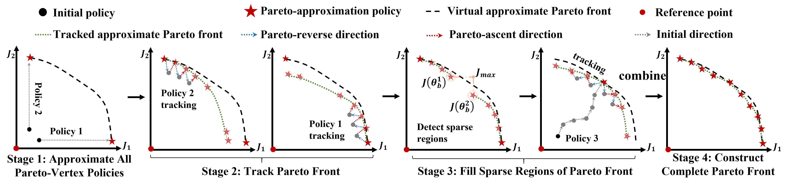

<h1 align="center">
  Population-Free Pareto Tracking for Sample-Efficient Multi-Policy MORL
</h1>

<p align="center">
  <b> Zeyu Zhao&ensp;&ensp;Yueling Che&ensp;&ensp;Kaichen Liu&ensp;&ensp;Jian Li&ensp;&ensp;Junmei Yao </b>
</p>


<p align="center">
  <a href="https://openreview.net/group?id=ICML.cc/2026/Conference">
  
</a>
  
  
  
  
</p>

---

## 🧠 Overview

Multi-objective reinforcement learning (MORL) aims to learn policies that balance multiple conflicting objectives. Existing multi-policy MORL methods typically rely on evolutionary populations, which often require extensive agent–environment interactions and suffer from poor sample efficiency.

In this paper, we propose **Multi-policy Pareto Front Tracking (MPFT)**, a population-free framework for sample-efficient multi-policy MORL. MPFT initializes Pareto front exploration using single-objective extreme policies and efficiently tracks the Pareto front without maintaining a self-evolving population. To further improve front coverage, MPFT adaptively densifies sparse regions of the Pareto frontier, enabling accurate approximation of diverse trade-off solutions.

MPFT can be seamlessly integrated with both online and offline MORL algorithms. We evaluate the framework on multiple robotic control benchmarks with up to three objectives, as well as high-dimensional MORL tasks involving more than three objectives. Experimental results demonstrate that MPFT achieves superior hypervolume and expected utility while significantly reducing agent–environment interactions compared with state-of-the-art baselines.

---

## 📌 Framework

<p align="center">
  
</p>

---

## 🚀 Highlights

- ✅ Population-free multi-policy MORL framework
- ✅ Efficient Pareto front tracking mechanism
- ✅ Adaptive sparse-region densification
- ✅ Compatible with both online and offline RL algorithms
- ✅ Improved sample efficiency and Pareto front coverage
- ✅ Strong performance on MORL benchmarks

---

## 📦 Installation

Create the conda environment:

```bash
conda create -n mpft python=3.11
conda activate mpft
```

Install dependencies:

```bash
pip install -r requirements.txt
```

---

## 🛠️ Usage

Example training command:

```bash
python MPFT_MOTD7.py --env Ant
```

Example environments:

- Ant
- HalfCheetah
- Walker2d
- Hopper
- Swimmer
- Humanoid

---

## 🧩 Project Structure

```text
.
├── images/                 # Figures and framework illustrations
├── MPFT-MOTD7/             # MOTD7 
├── MPFT-MOSAC/             # MOSAC 
├── MPFT-MOPPO/             # MOPPO 
├── PA2D-MORL/              # Baseline 
├── environments/           # Environments
├── requirements.txt
└── README.md
```

---

## 📖 Citation

If you find this repository useful in your research, please consider citing:

```bibtex
@inproceedings{zhao2026population,
  title={Population-Free Pareto Tracking for Sample-Efficient Multi-Policy MORL},
  author={Zhao, Zeyu and Che, Yueling and Liu, Kaichen and Li, Jian and Yao, Junmei},
  booktitle={Forty-third International Conference on Machine Learning},
  year={2026}
}
```


